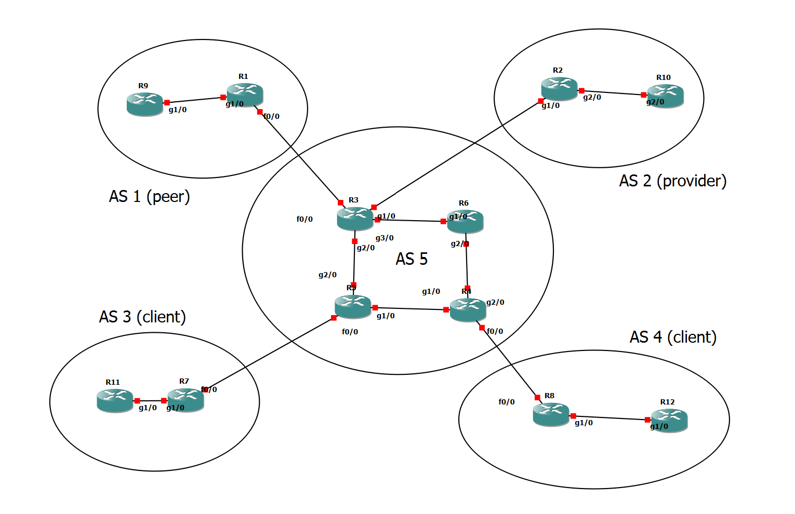

# GNS3

## Fonctionalités de notre programme
Le programme permet de créer des fichiers de configuration pour tous les routeurs des AS décrits dans un intent file au format JSON avec les fonctionalités suivantes : 
- Allocation automatisée des sous-réseaux et adresses IP sur chaque lien interne à une AS, ainsi que des adresses IP de loopback
- Paramétrage du coût OSPF d'un lien
- Tagging de communautés BGP et mise en place de route-map correspondants 
- Drag-and-Drop bot

## Détail sur les politiques BGP et les communautés
Les routes reçues d'un AS différent sont taguées par le routeur de bordure qui les reçoit selon le format standard suivant, numéro d'AS qui tague la communauté : numéro de communauté.
Les numéros de communautés ont pour tous les AS les correponsdances suivantes :
- AS:100 : cette route provient d'un provider
- AS:200 : cette route provient d'un client
- AS:300 : cette route provient d'un peer

Les routeurs de bordure appliquent à ces routes des règles afin de les retransmettre ou pas aux autres AS.
Les règles prédéfinies dans notre programme sont les suivantes : 

- frommyprovider : tague la communauté provider à la route entrante et met la localpref à 50
- frommypeer : tague la communauté peer et met la localpref à 120
- frommyclient : tague la communauté client et met la localpref à 150

- tomyprovider et tomyprovider : empêchent la transmission des routes taguées peer et provider (aux peers et aux providers). Ce sont deux règles distinctes pour permettre de leur ajouter des spécificités plus tard si nécessaire.

## Utilisation du programme
Pour pouvoir utiliser  notre programme, vous devez disposer d'un fichier json décrivant la configuration du réseau que vous voulez configurer et d'un projet GNS3 avec les routeurs et liens entre leurs interfaces correspondant. 

Pour lancer le programme, lancer le fichier main.py (commande python3 main.py) puis entrez le chemin de l'intent file que vous voulez utiliser. Une fois les fichiers de configurations générés, entrez le chemin du répertoire projet GNS3 où ils doivent être déplacés. Vous pouvez maintenant lancez le projet GNS3 et tout devrait être configuré selon l'intent file!

### Proposition de tests
Nous vous proposons de tester le programme avec le projet fourni dans le dossier GNS3_demo et le fichier intent_demo.json. Il est constitué d'un AS central (AS5) connecté à un provider (AS2), un peer (AS1) et deux clients (AS3 et AS4). 

Afin de voir l'effet des politiques BGP, vous pouvez tenter des pings entre le peer et le provider, ceux-ci ne devraient pas aboutir, alors que les pings vers les clients ou venant des clients atteignent tout le réseau.
Tous les AS sont configurés en RIP sauf l'AS central qui est en OSPF. Nous avons changé le coût OSPF du lien entre R3 et R6, celui-ci est à 20 (à la place de 1 par défaut) et vous devriez pouvoir voir comment ce lien n'est alors pas emprunté par exemple quand R6 veut joindre l'AS 1 ou R3 l'AS 2.

## Structure du JSON
Le premier niveau de clé du JSON correspond au numéro d'AS
pour chaque AS on a les clés associées aux valeurs suivantes  :

- IGP : associé à une chaîne de caractère correspondant au protocole interne à l'AS (OSPF ou RIP)
- relationships : contient un dictionnaire dont les clés sont les AS voisins et les valeurs une chaîne de caractère définissant leur position par rapport à l'AS parcouru (client, provider ou peer)
- ip_range : contient une liste de deux adresses IP définssant la plage d'adresses de l'AS
- loopback_range : similaire au paramètre précédent mais pour les adresses de loopback
- routers : dictionnaire dont les clés sont les numéros (stocké en chaine de caractère) des routers de l'AS et les valeurs des informations sur leurs interfaces

#### Détails du dictionnaire routers
Les clés du dictionnaire routers sont : 
- i_interface : un dictionnaire dont les clés sont les interfaces du routeur connectées à un routeur du même AS
La valeur associée est le nom du routeur auquelle l'interface est connectée.
Si l'AS utilise OSPF, cette valeur est une liste dont le deuxième élément est le coût du lien (0 si le coût par défaut doit être utilisé, le coût souhaité sinon)
- e_interface : similaire au précédent, ce dictionnaire a pour clés les interfaces du routeur connectées à un routeur d'un AS différent. La valeur associée est une liste dont le premier élément est le routeur voisin, le deuxième l'adresse qui doit être paramétrée sur l'interface et éventuellement en troisième une valeur par défaut à 0 afin de faciliter le traitement des coûts OSPF si nécessaire.
Les interfaces connectées entre deux AS ont une adresse IP prédéfinie car on estime que les coordinateurs des AS se sont mis d'accord entre eux pour mettre en place leurs sous-réseaux communs.
